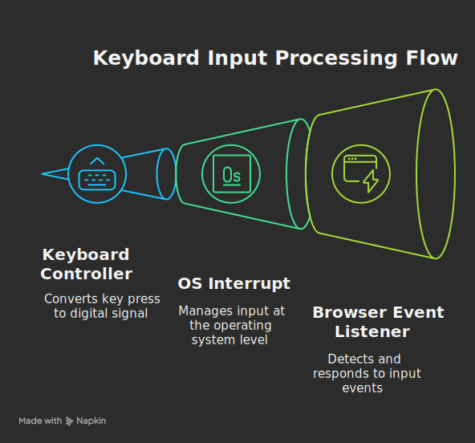
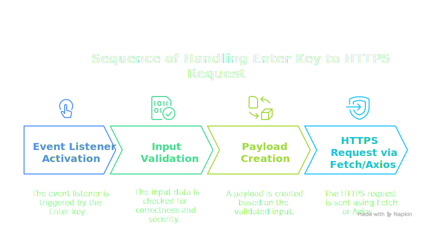
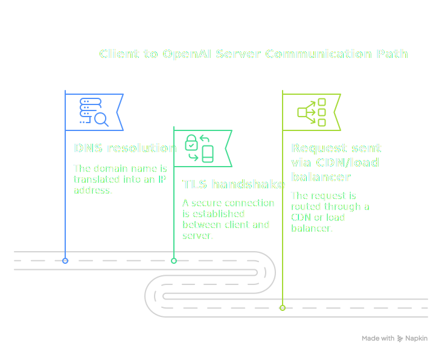
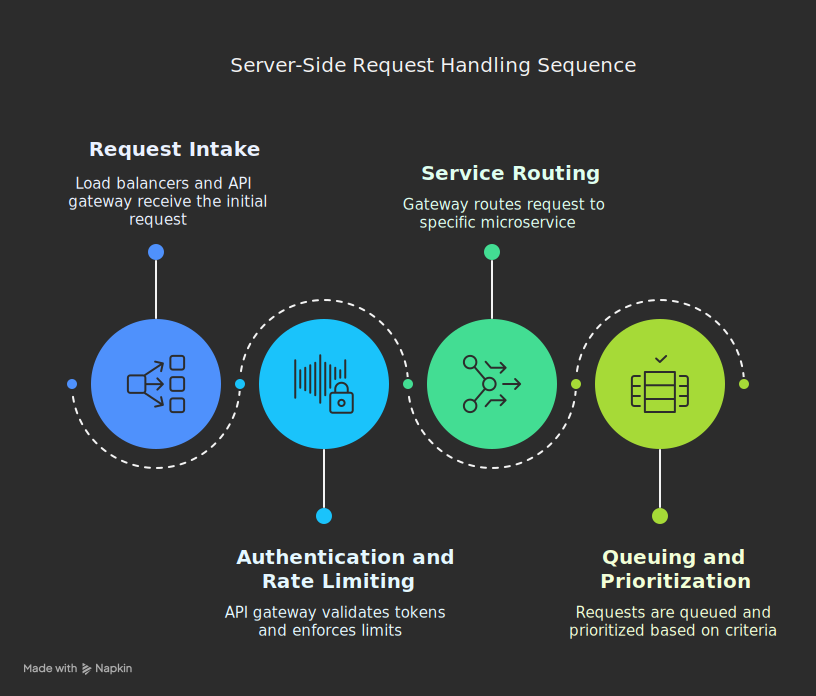
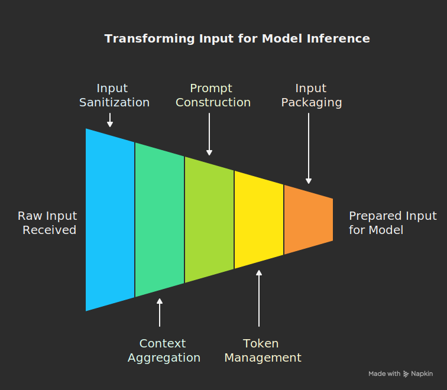
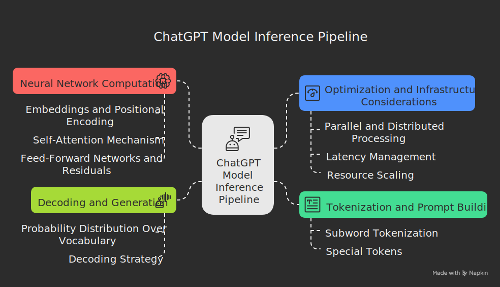
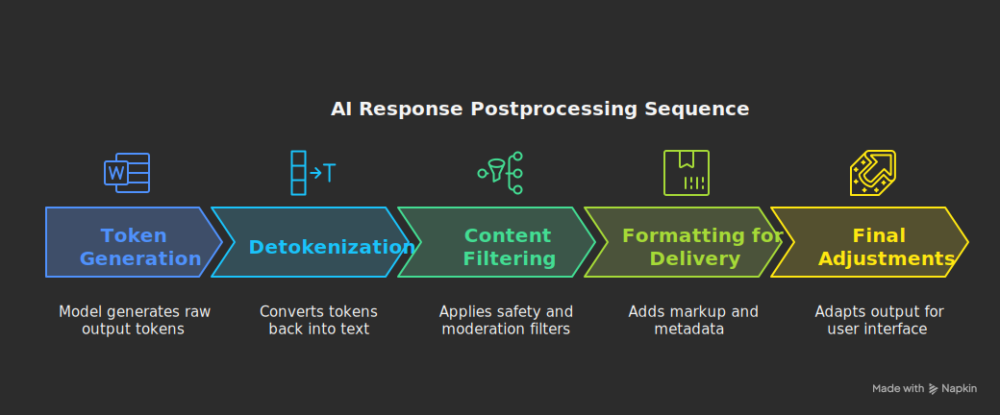
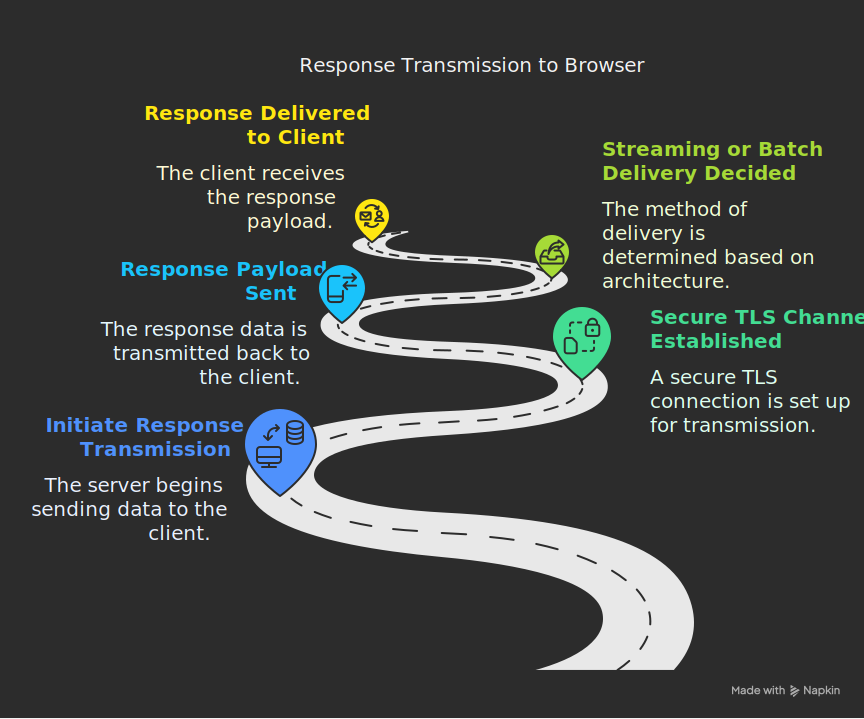
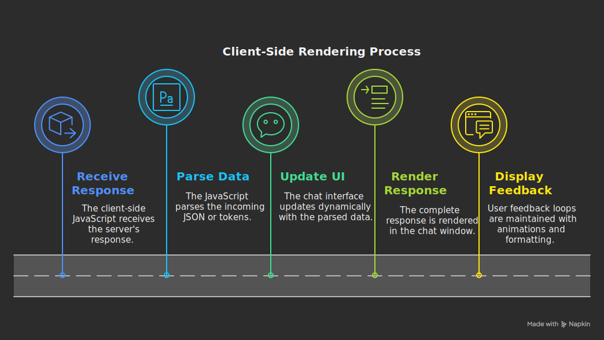

# What Happens When You Type into ChatGPT?

An attempt to answer the question:  
**“What happens when you type a question/instruction in the ChatGPT chat window and hit enter?”**  
This document is meant to be exhaustive, leaving no internal process unexamined—making it suitable for enthusiasts, engineers, and anyone curious about modern NLP and system interactions.

*Contributions are welcome; if you notice missing details or improvements that can be made, please send a pull request! This work is intended to be as granular as possible while remaining accessible.*

---

## Table of Contents

1. [User Input: From Key Press to Text Entry](#1-user-input-from-key-press-to-text-entry)
2. [Browser-Side Event Handling and Request Formation](#2-browser-side-event-handling-and-request-formation)
3. [Network Transmission: Securing and Sending the Query](#3-network-transmission-securing-and-sending-the-query)
4. [Server-Side Receipt: Authentication, Routing, and Queuing](#4-server-side-receipt-authentication-routing-and-queuing)
5. [Preprocessing and Context Management](#5-preprocessing-and-context-management)
    - [5.1 Input Sanitization & Normalization](#51-input-sanitization-and-normalization)
    - [5.2 Context Aggregation](#52-context-aggregation)
    - [5.3 Input Packaging for the Model](#53-input-packaging-for-the-model) 
6. [The ChatGPT Model Inference Pipeline](#6-the-chatgpt-model-inference-pipeline)
    - [6.1 Tokenization and Prompt Building](#61-tokenization-and-prompt-building)
    - [6.2 Neural Network Computation: Transformer Architecture](#62-neural-network-computation-transformer-architecture)
    - [6.3 Decoding and Generation](#63-decoding-and-generation)
    - [6.4 Optimization and Infrastructure Considerations](#64-optimization-and-infrastructure-considerations)
7. [Postprocessing and Formatting the Response](#7-postprocessing-and-formatting-the-response)
    - [7.1 Detokenization and Text Reassembly](#71-detokenization-and-text-reassembly)
    - [7.2 Content Filtering and Safety Mechanisms](#72-content-filtering-and-safety-mechanisms)
    - [7.3 Formatting for Client Delivery](#73-formatting-for-client-delivery)
    - [7.4 Final Output Adjustments](#74-final-output-adjustments)
8. [Returning the Response: Network Transit Back to the Browser](#8-returning-the-response-network-transit-back-to-the-browser)
9. [Client-Side Rendering and Display](#9-client-side-rendering-and-display)
10. [Additional Considerations](#10-additional-considerations)
    - [10.1 Streaming, Latency, and User Experience](#101-streaming-latency-and-user-experience)
    - [10.2 Logging, Monitoring, and Privacy](#102-logging-monitoring-and-privacy)
11. [Conclusion and Future Work](#11-conclusion-and-future-work)

---

## 1. User Input: From Key Press to Text Entry

<p align="center">
  
</p>

### Physical Interaction  
- **Key Press Mechanics:**  
  When you press a key (or tap on a virtual keyboard), a physical electrical signal is generated (via a USB, Bluetooth, or capacitive touch sensor) and converted into a digital key code by the device’s firmware.  
- **Debounce and Signal Conditioning:**  
  Modern keyboards use debouncing algorithms and hardware buffers to ensure only one key press is registered, even if there is electrical noise.

### Application-Level Capture  
- **Frontend Event Listeners:**  
  In the ChatGPT web client, JavaScript event listeners capture keystrokes and update the text input element in real time.  
- **Auto-Completion and Local Enhancements:**  
  (Optionally) if the UI includes suggestions or auto-complete features, these operate based on local caches of previous interactions.


<br>

  > This example demonstrates how a web page captures key presses from a USB keyboard or touchscreen. It uses HTML and JavaScript to log each keypress and display input in a text field.

```html
<!DOCTYPE html>
<html>
<head>
  <title>Chat Input Capture</title>
  <script>
    // Log the key pressed and update the input field.
    function handleKeyPress(event) {
      console.log("Key pressed:", event.key);
      // Further processing could include debouncing or preprocessing the input.
    }

    function init() {
      const inputField = document.getElementById("chatInput");
      inputField.addEventListener("keypress", handleKeyPress);
    }

    window.addEventListener("DOMContentLoaded", init);
  </script>
</head>
<body>
  <input type="text" id="chatInput" placeholder="Type your question here...">
</body>
</html>
```

---

## 2. Browser-Side Event Handling and Request Formation

<p align="center">
  
</p>

### Input Finalization  
- **User Triggers Submission:**  
  Pressing “Enter” or clicking a submit button signals that the query is complete. This final input event triggers the client logic to package the request.
  
### Constructing the Request Payload  
- **Data Collection:**  
  The text is collected from the input field, and the client may also collect contextual data such as conversation history, client metadata (browser type, session tokens), and timestamp.
- **Formatting and Serialization:**  
  The payload is serialized as JSON (or another lightweight format) and prepared for an HTTPS request, conforming to the API’s schema.
- **Client-Side Validation:**  
  Minimal validation is performed (for instance, ensuring that non-empty content is provided) before sending.

<br>

> This snippet shows how the browser captures the final input (using the Enter key), forms a request payload, and sends the data to a server using the `fetch` API.

```html
<!DOCTYPE html>
<html>
<head>
  <title>Chat Submission Example</title>
  <script>
    // Function to send the chat message to a server.
    async function sendChatMessage(message) {
      const payload = {
        message: message,
        timestamp: new Date().toISOString()
      };

      try {
        const response = await fetch('https://api.example.com/chat', {
          method: 'POST',
          headers: {
            'Content-Type': 'application/json'
          },
          body: JSON.stringify(payload)
        });
        const data = await response.json();
        console.log("Response from server:", data);
      } catch (err) {
        console.error("Error sending message:", err);
      }
    }

    // Listen for the Enter key and trigger submission.
    function handleKeyPress(event) {
      if (event.key === "Enter") {
        const message = event.target.value;
        sendChatMessage(message);
        event.target.value = ""; // Clear the input field
      }
    }

    function init() {
      const inputField = document.getElementById("chatInput");
      inputField.addEventListener("keypress", handleKeyPress);
    }

    window.addEventListener("DOMContentLoaded", init);
  </script>
</head>
<body>
  <input type="text" id="chatInput" placeholder="Type your question and press Enter...">
  <div id="chatResponse"></div>
</body>
</html>
```

---

## 3. Network Transmission: Securing and Sending the Query

<p align="center">
  
</p>

### Connection Establishment  
- **DNS Resolution and ARP:**  
  The client’s browser performs a DNS lookup for the ChatGPT API endpoint, followed by any ARP lookups if communicating over a local network.
  
### Secure Communication  
- **TLS Handshake:**  
  A secure TLS connection is established between the client and the server. This involves exchanging cryptographic parameters and verifying certificates.
- **HTTPS Request:**  
  The client sends the encrypted payload over this secure channel, ensuring confidentiality and integrity.

### Transport Protocol  
- **HTTP/2 or WebSockets:**  
  Many modern clients use protocols like HTTP/2 or persistent WebSocket connections for low-latency interactions, which can also allow token-by-token streaming of the response.

<br>

> In modern web applications, secure transmission is handled by the browser when the URL begins with `https://`. The snippet above (using `fetch`) assumes all data is sent over TLS. Here’s a brief note and code snippet to emphasize this:

```javascript
// Example: Secure fetch request (handled automatically when using https://)
async function secureFetchExample(message) {
  const payload = { message: message };
  const response = await fetch('https://api.example.com/chat', {
    method: 'POST',
    headers: { 'Content-Type': 'application/json' },
    body: JSON.stringify(payload)
  });
  return response.json();
}
```

*Note: The use of HTTPS ensures that TLS/SSL protocols secure the transmission.*

---

## 4. Server-Side Receipt: Authentication, Routing, and Queuing

<p align="center">
  
</p>

### API Gateway and Load Balancing  
- **Request Intake:**  
  The initial request is received by load balancers and an API gateway that distributes the workload among backend servers.
- **Authentication and Rate Limiting:**  
  The API gateway validates session tokens, API keys, and enforces rate limits or quotas before routing the request forward.

### Service Routing  
- **Microservice Architecture:**  
  The gateway routes the request to the specific microservice responsible for handling conversation input. This service is often stateless and works in tandem with session management systems.

### Queuing and Prioritization  
- **Task Queues:**  
  In cases of high load, incoming requests may be queued. The system may prioritize based on request type or user status.

<br>

> Below is a Node.js example using Express to accept chat messages. This snippet simulates authenticating requests (using JWT), logging the input, and enqueuing or directly processing the request.

```javascript
// Install dependencies: express, body-parser, jsonwebtoken (npm install express body-parser jsonwebtoken)
const express = require('express');
const bodyParser = require('body-parser');
const jwt = require('jsonwebtoken');

const app = express();
app.use(bodyParser.json());

// Simple middleware for token authentication.
function authenticateToken(req, res, next) {
  const token = req.headers['authorization']?.split(' ')[1];
  if (!token) return res.sendStatus(401); // Unauthorized if no token

  // Dummy secret for demonstration purposes
  jwt.verify(token, "dummySecret", (err, user) => {
    if (err) return res.sendStatus(403);
    req.user = user;
    next();
  });
}

// Endpoint to receive chat messages.
app.post('/chat', authenticateToken, (req, res) => {
  const { message, timestamp } = req.body;
  console.log("Received message:", message, "at", timestamp, "from user:", req.user);

  // Here you could enqueue the message for asynchronous processing, e.g.,
  // queue.add({ user: req.user, message, timestamp });
  
  // For simulation, send an immediate acknowledgment.
  res.json({ status: "received", message: message });
});

const PORT = process.env.PORT || 3000;
app.listen(PORT, () => {
  console.log(`Server listening on port ${PORT}`);
});
```

---

## 5. Preprocessing and Context Management

<p align="center">
  
</p>

Before the actual model inference takes place, the system must carefully prepare the input. This stage ensures that the query and any prior conversation context are clean, coherently combined, and formatted to be processed by the neural network. Let’s dive into the steps:

### 5.1 Input Sanitization and Normalization

- **Raw Input Receipt:**  
  When you submit your query, the backend receives a string from the client.  
- **Sanitization:**  
  - **Security and Integrity:** The input is scanned for potentially dangerous elements (e.g., code injections, control characters) and is normalized.  
  - **Unicode Normalization:** Text might be converted to a standard Unicode form (e.g., NFC) to avoid issues with different representations of similar characters.
- **Normalization:**  
  - **Spacing and Punctuation:** The system may trim leading/trailing spaces, adjust punctuations, and ensure a consistent formatting.  
  - **Case Sensitivity:** Although preserving case is often important for maintaining context (like names or specific expressions), some internal routines may convert parts of the text for reliable matching.

### 5.2 Context Aggregation

- **Session History Gathering:**  
  For multi-turn conversations, the system retrieves previous user messages and the assistant’s replies.  
  - **Relevance and Summarization:**  
    Sometimes, when the conversation exceeds the model’s token limit, earlier messages may be summarized or pruned while ensuring that critical context is preserved.
- **Prompt Construction:**  
  - **Structured Format:** The system combines the current input with prior turns (often formatted with markers like `Human:` and `Assistant:`) so that the model understands the conversation’s structure.  
  - **Instruction Inclusion:** Any system-level instructions, which guide the tone or behavior of the response, are prepended as part of the prompt.
- **Token Window Management:**  
  - **Truncation or Summarization:** If the overall context is too long, the system must decide which parts to drop while keeping essential context intact.  
  - **Dynamic Context Updates:** The context is updated after every turn to feed relevant information into the next inference round.

### 5.3 Input Packaging for the Model

- **Serialization:**  
  The fully constructed prompt is serialized (typically as JSON) and passed to the model’s inference engine.  
- **Metadata Attachment:**  
  Additional metadata (e.g., conversation identifiers, language preferences, client session info) may accompany the prompt for logging, personalization, or analytics purposes.

<br>

>This snippet shows how you might build a prompt from the current input, previous conversation history, and optional system instructions:

```python
def build_prompt(user_input, conversation_history=None, system_instructions=None):
    """
    Combine system instructions, conversation history, and the current user input
    into a prompt formatted for the language model.
    
    Args:
      user_input (str): The current query provided by the user.
      conversation_history (list of str, optional): A list of previous conversation turns,
          formatted as "Human: ..." and "Assistant: ...".
      system_instructions (str, optional): Context or instructions for the model behavior.
    
    Returns:
      str: A combined prompt.
    """
    prompt = ""
    if system_instructions:
        prompt += f"System: {system_instructions}\n\n"
    if conversation_history:
        prompt += "\n".join(conversation_history) + "\n"
    prompt += f"Human: {user_input}\nAssistant: "
    return prompt

# Example usage:
conversation_history = [
    "Human: Hello",
    "Assistant: Hi, how can I help you today?"
]
system_instructions = "You are a helpful and friendly assistant."
user_input = "What is the weather like today?"
prompt = build_prompt(user_input, conversation_history, system_instructions)
print("Constructed Prompt:\n", prompt)
```

---

## 6. The ChatGPT Model Inference Pipeline

<p align="center">
  
</p>

This is the core stage where the model processes the prepared input and generates a response. The pipeline is typically divided into several sub-steps: tokenization, neural network computation via a transformer architecture, and the decoding process.

### 6.1 Tokenization and Prompt Building

- **Tokenization Process:**  
  - **Subword Tokenization:**  
    The prompt is broken down into tokens using techniques such as Byte-Pair Encoding (BPE) or similar subword algorithms. This is crucial for handling rare words, abbreviations, or even emojis.  
  - **Special Tokens:**  
    Tokens that indicate the start or end of text segments (for example, a system-specific start-of-sequence token) are inserted. This helps define conversational boundaries and can signal the model when a new turn begins.
- **Handling Context Windows:**  
  - **Ensuring Fit:**  
    The entire tokenized prompt must fit within the model’s maximum context window. Techniques like truncation or summarization are applied if the input exceeds the limit.
  - **Attention Masking:**  
    An attention mask is generated, signaling which tokens are valid input and which parts are padding, to optimize the transformer’s computation.

### 6.2 Neural Network Computation: Transformer Architecture

- **Embeddings and Positional Encoding:**  
  - **Word Embeddings:**  
    Each token is mapped to a dense vector that captures its semantic meaning.  
  - **Positional Embeddings:**  
    Since transformers process tokens in parallel without inherent order, positional embeddings are added to embed the notion of order in the token sequence.
- **Self-Attention Mechanism:**  
  - **Multi-head Attention:**  
    The transformer uses multi-head self-attention to compute the relationships between tokens. Each head generates a set of attention weights that determine how much each token should “pay attention” to every other token.  
  - **Query, Key, Value Computation:**  
    For each token, the network computes queries, keys, and values. The attention scores are then derived by taking the dot product of queries and keys, normalized, and used to weight the corresponding values.
- **Feed-Forward Networks and Residuals:**  
  - **Layer-Wise Processing:**  
    After attention, each token representation is processed by a position-wise feed-forward network.  
  - **Skip Connections and Normalization:**  
    Residual connections (skip connections) and layer normalization are applied to help the flow of gradients during training and to stabilize the learning process.
- **Stacked Transformer Layers:**  
  - **Deep Architecture:**  
    The token representations pass through multiple layers (for example, 12, 24, or more depending on the model size), with each layer refining the contextual understanding.
  - **Contextual Representation:**  
    The final output is a sequence of high-dimensional vectors where each vector encapsulates the context, syntax, and semantic relationships present in the input prompt.

### 6.3 Decoding and Generation

- **Probability Distribution Over Vocabulary:**  
  - **Softmax Layer:**  
    The final hidden states of the transformer are fed into a softmax layer that computes a probability distribution across the entire vocabulary for the next token.
- **Decoding Strategy:**  
  - **Greedy vs. Sampling:**  
    - **Greedy Decoding:** Chooses the token with the highest probability at every step (simple but may lead to repetitive or dull output).  
    - **Stochastic Sampling:** Techniques like temperature sampling or nucleus (top-p) sampling introduce randomness, making the output more varied and human-like.
  - **Sequential Generation:**  
    The model then generates one token at a time. After producing a token, it appends this token to the input sequence, updates its internal state (often using caching mechanisms to avoid recomputation), and predicts the next token in a loop.
- **End-of-Sequence Detection:**  
  - **Termination Condition:**  
    The loop continues until the model outputs a special end-of-sequence token or the generation reaches a pre-defined token limit.  
  - **Dynamic Adjustments:**  
    The system may adjust the generation parameters on the fly based on prompt characteristics (for instance, reducing randomness for more factual answers).

### 6.4 Optimization and Infrastructure Considerations

- **Parallel and Distributed Processing:**  
  - **Inference Across GPUs/Nodes:**  
    Large models often run in distributed computing environments where tasks are parallelized across multiple GPUs.  
- **Latency Management:**  
  - **Caching Intermediate Results:**  
    To reduce latency, previously computed key-value pairs can be cached, allowing each new token generation to be more efficient.
  - **Optimized Libraries:**  
    Libraries such as cuDNN or TensorRT are typically leveraged for efficient matrix operations, ensuring fast inference.
- **Resource Scaling:**  
  - **Dynamic Model Routing:**  
    Requests might be dynamically distributed based on load, and occasionally, model quantization or distillation techniques may be employed to expedite computation with minimal trade-offs on performance.

<br>

> Below is an example using the Hugging Face Transformers library to tokenize the prompt, run inference through a transformer model, and decode the output. This snippet uses a causal language model (for example, GPT‑2) for demonstration:

```python
from transformers import AutoTokenizer, AutoModelForCausalLM
import torch

# Load pre-trained tokenizer and model (using GPT-2 as an example)
tokenizer = AutoTokenizer.from_pretrained("gpt2")
model = AutoModelForCausalLM.from_pretrained("gpt2")

def generate_response(prompt, max_length=150, temperature=0.7, top_p=0.9):
    """
    Generate a model response for a given prompt using sampling.
    
    Args:
      prompt (str): The input text prompt.
      max_length (int): Maximum length of the generated sequence (including prompt).
      temperature (float): Temperature for sampling; lower values make output less random.
      top_p (float): Top-p (nucleus) sampling parameter.
      
    Returns:
      str: The generated text response.
    """
    # Encode the prompt into tokens
    input_ids = tokenizer.encode(prompt, return_tensors="pt")
    
    # Generate response tokens using sampling
    output_ids = model.generate(
        input_ids,
        max_length=max_length,
        temperature=temperature,
        top_p=top_p,
        do_sample=True,
        eos_token_id=tokenizer.eos_token_id  # Stop if end-of-sequence token is generated
    )
    
    # Decode tokens to text, skipping special tokens for readability
    response_text = tokenizer.decode(output_ids[0], skip_special_tokens=True)
    return response_text

# Generate a response using the prompt from the previous step
response = generate_response(prompt)
print("Raw Model Output:\n", response)
```
---

## 7. Postprocessing and Formatting the Response

<p align="center">
  
</p>

Once the raw output tokens have been generated by the model, they need to be converted into a final, polished response that will be presented to the user. This step involves detokenization, filtering, and packaging the output.

### 7.1 Detokenization and Text Reassembly

- **Token-to-Text Conversion:**  
  - **Mapping Tokens Back:**  
    The sequence of generated token IDs is converted back into text strings. The detokenizer takes care of merging subword tokens into full words and ensuring that punctuation is correctly placed.
- **Whitespace and Punctuation Adjustments:**  
  - **Cleaning Artifacts:**  
    The conversion process often involves post-processing to fix spacing issues (for example, ensuring that punctuation does not have extra spaces before it) and to normalize quotes or special characters.

### 7.2 Content Filtering and Safety Mechanisms

- **Moderation Filters:**  
  - **Safety Layers:**  
    The raw output is passed through safety and content-moderation filters. These filters check for harmful language, misinformation, or any content that could violate usage policies.
  - **Adjustments and Censorship:**  
    If problematic content is detected, it might be altered, partially censored, or flagged for further handling.
- **Coherence and Fluency Checks:**  
  - **Quality Assurance:**  
    Additional checks might be applied to detect anomalies like repetitive phrasing or abrupt topic shifts. In some cases, a secondary correction pass may be triggered to refine the response.

### 7.3 Formatting for Client Delivery

- **Markup Conversion:**  
  - **Markdown/HTML Styling:**  
    The plain text response is often enriched with formatting instructions such as markdown or HTML. This allows for better presentation in the chat UI, including bolding, italics, lists, or code blocks.
- **Packaging in a JSON Structure:**  
  - **Metadata Inclusion:**  
    The final response is encapsulated in a JSON payload that includes the generated text along with any metadata (e.g., time-stamps, token usage, model version).  
  - **Streaming Considerations:**  
    If the response is streamed token-by-token, additional indicators may be included to inform the client of partial completions and to smoothly handle incremental updates.
  
### 7.4 Final Output Adjustments

- **User Interface Adaptation:**  
  - **Rendering Logic:**  
    The client-side code may further adjust the text—for example, by applying syntax highlighting for code snippets or embedding links—ensuring the output is both readable and interactive.
- **Logging and Feedback Integration:**  
  - **Analytics and Iteration:**  
    The final output, along with user feedback (such as ratings or corrections), may be logged. This data can be used to improve future responses and to optimize model performance over time.

<br>

> After the model produces raw output, this code demonstrates steps to clean up the text, apply basic safety or formatting adjustments, and package the result as a JSON payload:

```python
import json

def postprocess_response(generated_text):
    """
    Clean up and format the raw text generated by the model.
    
    Args:
      generated_text (str): The raw text output from the model.
      
    Returns:
      str: The cleaned and formatted response text.
    """
    # Remove unwanted whitespace or formatting artifacts.
    cleaned_text = generated_text.strip()
    # Additional filtering (e.g., profanity or sensitive content) could be applied here.
    return cleaned_text

def package_response(response_text, token_usage=None, model_version="gpt2"):
    """
    Package the final response into a JSON payload for delivery.
    
    Args:
      response_text (str): The postprocessed response text.
      token_usage (int, optional): Approximate number of tokens consumed or generated.
      model_version (str, optional): Identifier for the model version used.
    
    Returns:
      str: JSON-formatted response.
    """
    payload = {
        "response": response_text,
        "token_usage": token_usage,
        "model_version": model_version
    }
    return json.dumps(payload, indent=2)

# Postprocess the generated response
final_response_text = postprocess_response(response)
# Package the response into JSON
json_payload = package_response(final_response_text, token_usage=150, model_version="gpt2")
print("Final JSON Payload:\n", json_payload)
```

---

## 8. Returning the Response: Network Transit Back to the Browser

<p align="center">
  
</p>

- **Secure Response Transmission:**  
  The response payload is sent over the secure TLS channel back to the client.
- **Streaming or Batch Delivery:**  
  Depending on the architecture, the response may be streamed (token by token) or sent as a complete document.

<br>

> Below is an extension of the server-side code to simulate generating an AI response and returning it as JSON. The Express endpoint processes the message and responds.

```javascript
// Extend the /chat endpoint to simulate AI processing and return a response.
app.post('/chat', authenticateToken, async (req, res) => {
  const { message } = req.body;
  console.log("Received message:", message);
  
  // Simulate asynchronous processing (replace with actual model inference call)
  const aiResponse = await simulateAIResponse(message);
  
  // Return the AI response to the client
  res.json({ response: aiResponse });
});

// Dummy function to simulate AI processing
async function simulateAIResponse(message) {
  return `Echo: ${message}`; // In practice, call the model inference pipeline here.
}
```

---

## 9. Client-Side Rendering and Display

<p align="center">
  
</p>

### Receiving the Response  
- **Data Parsing:**  
  The client-side JavaScript receives and parses the incoming JSON (or streamed tokens).
- **Dynamic UI Updates:**  
  The chat interface updates dynamically—either by gradually revealing text (if streamed) or by rendering the complete answer once received.
- **User Feedback Loops:**  
  The user sees the generated response as it appears on the chat window, possibly with animations or formatting that maintains a conversational look and feel.

<br>

> After receiving the JSON response from the server, the client-side code updates the page to display the AI's response. This example shows how to append the response to a chat display element.

```html
<!DOCTYPE html>
<html>
<head>
  <title>Chat Display Example</title>
  <script>
    async function sendChatMessage(message) {
      const payload = { message: message, timestamp: new Date().toISOString() };
      try {
        const response = await fetch('https://api.example.com/chat', {
          method: 'POST',
          headers: {
            'Content-Type': 'application/json',
            'Authorization': 'Bearer your_jwt_token_here'
          },
          body: JSON.stringify(payload)
        });
        const data = await response.json();
        displayResponse(data.response);
      } catch (err) {
        console.error("Error sending message:", err);
      }
    }

    function handleKeyPress(event) {
      if (event.key === "Enter") {
        const message = event.target.value;
        sendChatMessage(message);
        event.target.value = "";
      }
    }

    function displayResponse(text) {
      const chatDiv = document.getElementById("chatResponse");
      const p = document.createElement("p");
      p.textContent = text;
      chatDiv.appendChild(p);
    }

    function init() {
      const inputField = document.getElementById("chatInput");
      inputField.addEventListener("keypress", handleKeyPress);
    }

    window.addEventListener("DOMContentLoaded", init);
  </script>
</head>
<body>
  <input type="text" id="chatInput" placeholder="Type your question and press Enter...">
  <div id="chatResponse"></div>
</body>
</html>
```

---

## 10. Additional Considerations

### 10.1 Streaming, Latency, and User Experience

- **Latency Optimizations:**  
  Techniques to reduce end-to-end latency (such as caching, load balancing, or pre-warming model instances) are employed.
- **User Experience Enhancements:**  
  Progressive rendering, typing indicators, and smooth transitions help maintain a responsive and engaging conversation flow.

### 10.2 Logging, Monitoring, and Privacy

- **Analytics and Logging:**  
  Each interaction may be logged for system improvement, performance monitoring, and debugging while being mindful of privacy.
- **Data Privacy:**  
  Secure transmission and anonymization strategies ensure user data is protected. Systems are designed to comply with data protection regulations.
- **Feedback Collection:**  
  Mechanisms for users to rate responses or provide feedback can be integrated to improve model performance over time.

<br>


> A simplified example using Node.js and the Winston logging library shows how to log request details and responses. This aids in monitoring and debugging, and can be extended to integrate with full observability platforms.

```javascript
// Install Winston: npm install winston
const winston = require('winston');

// Configure Winston logger to log both to the console and to a file.
const logger = winston.createLogger({
  level: 'info',
  format: winston.format.combine(
      winston.format.timestamp(),
      winston.format.json()
  ),
  transports: [
    new winston.transports.Console(),
    new winston.transports.File({ filename: 'chat_app.log' })
  ]
});

// Middleware example: Log every incoming request.
app.use((req, res, next) => {
  logger.info('Incoming request', { method: req.method, url: req.url, timestamp: new Date().toISOString() });
  next();
});

// Use logging in the chat endpoint.
app.post('/chat', authenticateToken, async (req, res) => {
  const { message } = req.body;
  logger.info('Received chat message', { user: req.user, message: message });
  
  const aiResponse = await simulateAIResponse(message);
  
  logger.info('Sending chat response', { response: aiResponse });
  res.json({ response: aiResponse });
});
```

---

## 11. Conclusion and Future Work

- **Summary:**  
  This document outlines in detail the inner workings of a ChatGPT interaction—from the moment you type a query to the point where you see a response rendered on your screen.  
- **Invitation for Collaboration:**  
  Like the “what-happens-when” repository, this project is open for contributions. There are countless nuances—from hardware-level events to deep neural network mechanics—that can be expanded, updated, or refined.
- **Next Steps:**  
  Suggestions for further sections include detailed case studies (e.g., handling ambiguous queries, multi-turn contexts, or error recovery) and discussions on the evolving nature of large language models.

---

## How to Use This Repository

- **For Developers:**  
  Use it as a learning tool for understanding modern application stacks, from frontend event handling to deep neural network inference.
- **For Researchers:**  
  Gain insights into areas where further technical optimizations or studies on latency, accuracy, and user experience can be conducted.
- **For Enthusiasts:**  
  Deep-dive into the fascinating interplay between hardware, software, and AI that makes ChatGPT—and similar systems—possible.

